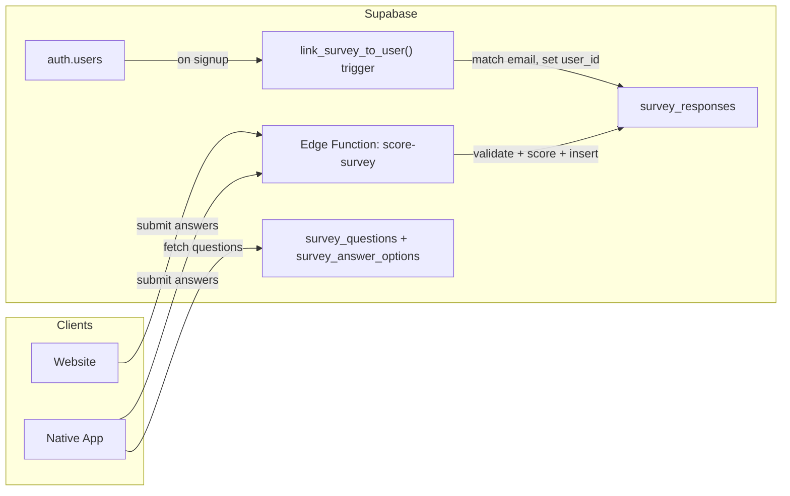

# Survey Edge Function + Questions Table + Email Linking

## Architecture Overview



- **Website**: keeps its hardcoded UI (no visual changes), but submits to the edge function instead of the Next.js API route. Collects optional email on results page.
- **Native App**: fetches questions/options from DB tables, submits answers to the same edge function. Authenticated users are linked directly via `user_id`.
- **Edge function**: single source of truth for scoring rules. Validates, scores, saves, returns results.
- **DB trigger**: when a user signs up in the app, automatically links any existing survey response that matches their email.

---

## 1. Initialize Supabase project locally

Run `supabase init` to create the `supabase/` directory with `config.toml`. This gives us a place for migrations and edge functions.

---

## 2. Database migrations

### 2a. `survey_questions` table

Stores every question so the native app can dynamically render the survey.

```sql
create table public.survey_questions (
  id            uuid primary key default gen_random_uuid(),
  field_key     text unique not null,       -- "age", "gender", "daily_movement", etc.
  step_key      text not null,              -- "profile", "activity", "cardio", etc.
  step_order    smallint not null,          -- 0-based order of this step
  field_order   smallint not null,          -- order within the step
  question_type text not null,              -- "numeric_input" | "single_select" | "boolean_toggle"
  label_de      text not null,              -- German display label
  unit          text,                       -- "cm", "kg", "mmHg", "%", "mg/dL"
  min_value     numeric,                    -- for numeric inputs
  max_value     numeric,
  default_value numeric,                    -- e.g. 5.6 for hba1c
  depends_on    text,                       -- field_key of parent (nullable)
  depends_on_value text,                    -- show when parent = this value
  created_at    timestamptz default now()
);
```

### 2b. `survey_answer_options` table

```sql
create table public.survey_answer_options (
  id           uuid primary key default gen_random_uuid(),
  question_id  uuid references public.survey_questions(id) on delete cascade,
  value        text not null,               -- stored value: "female", "0/Wo.", "low"
  label_de     text not null,               -- display: "Weiblich", "0/Wo.", "Niedrig"
  sort_order   smallint not null default 0
);
```

### 2c. Alter `survey_responses` table

Add columns for user linking and full score storage:

```sql
alter table public.survey_responses
  add column if not exists email         text,
  add column if not exists user_id       uuid references auth.users(id),
  add column if not exists score_breakdown jsonb;

create index idx_survey_responses_email on public.survey_responses(email) where email is not null;
create index idx_survey_responses_user_id on public.survey_responses(user_id) where user_id is not null;
```

### 2d. Auto-link trigger

When a new user signs up (row inserted in `auth.users`), look for an unlinked survey response with the same email and attach it:

```sql
create or replace function public.link_survey_to_user()
returns trigger as $$
begin
  update public.survey_responses
  set user_id = new.id
  where email = new.email
    and user_id is null;
  return new;
end;
$$ language plpgsql security definer;

create trigger trg_link_survey_on_signup
  after insert on auth.users
  for each row execute function public.link_survey_to_user();
```

### 2e. RLS policies

Enable RLS on the new tables. `survey_questions` and `survey_answer_options` are read-only for the anon key. `survey_responses` allows insert from anon/authenticated and select only own rows for authenticated users.

### 2f. Seed data

A seed migration that inserts all 20 questions and their answer options, derived from the current hardcoded config in `[website/src/lib/surveyConfig.ts](website/src/lib/surveyConfig.ts)` and the step component files.

---

## 3. Edge function: `score-survey`

Create `supabase/functions/score-survey/index.ts`.

This function:

1. Accepts a POST with the survey answers (same shape as current `ScoreInput`) plus optional `email` and `user_id`
2. Validates all fields (ranges from `[surveyConfig.ts` LIMITS](website/src/lib/surveyConfig.ts))
3. Runs all 17 scoring rules (ported from `[lib/score.ts](website/src/lib/score.ts)`)
4. Computes `biological_age` and `pace_of_aging`
5. Inserts into `survey_responses` (including `email`, `user_id`, `score_breakdown`)
6. Returns `{ id, totalDelta, biologicalAge, bmi, breakdown }`

The function uses the Supabase service role key from environment variables to insert. The scoring logic is a direct port of the existing `scoreSurvey()` function.

---

## 4. Website changes (minimal)

### 4a. Replace Next.js API route call

In `[website/src/app/survey/page.tsx](website/src/app/survey/page.tsx)`, change the `submit()` function to call the Supabase edge function directly instead of `/api/survey`. Scoring still happens client-side for instant results display, but the edge function re-scores server-side for integrity.

The fetch call changes from:

```typescript
const res = await fetch("/api/survey", { ... });
```

to:

```typescript
const res = await fetch(
  `${process.env.NEXT_PUBLIC_SUPABASE_URL}/functions/v1/score-survey`,
  {
    method: "POST",
    headers: {
      "Content-Type": "application/json",
      Authorization: `Bearer ${process.env.NEXT_PUBLIC_SUPABASE_ANON_KEY}`,
    },
    body: JSON.stringify({ ...fixedPayload, email: emailValue }),
  },
);
```

### 4b. Add optional email field to results page

In `[website/src/app/survey/components/ResultsPreview.tsx](website/src/app/survey/components/ResultsPreview.tsx)`, add an optional email input field below the results. When the user enters an email, it gets sent along with the response data. This allows linking the response to their app account later.

### 4c. Add `NEXT_PUBLIC_SUPABASE_ANON_KEY` env var

Add the anon key to `website/.env.local` (needed for calling the edge function from the client).

### 4d. Keep or deprecate the Next.js API route

The existing `[website/src/app/api/survey/route.ts](website/src/app/api/survey/route.ts)` can be removed since the edge function handles everything. Alternatively, keep it as a thin proxy during the transition.

---

## 5. App integration points (for reference)

The native app will:

1. Fetch questions: `GET /rest/v1/survey_questions?select=*,survey_answer_options(*)&order=step_order,field_order`
2. Submit answers: `POST /functions/v1/score-survey` with `user_id` from auth session
3. Check existing response: `GET /rest/v1/survey_responses?user_id=eq.{uid}&select=id,biological_age,pace_of_aging&limit=1`
4. If a response exists, skip the survey and show cached results

---

## Files changed / created

| Action            | File                                                                     |
| ----------------- | ------------------------------------------------------------------------ |
| Create            | `supabase/config.toml` (via `supabase init`)                             |
| Create            | `supabase/migrations/001_survey_questions.sql`                           |
| Create            | `supabase/migrations/002_alter_survey_responses.sql`                     |
| Create            | `supabase/migrations/003_seed_questions.sql`                             |
| Create            | `supabase/functions/score-survey/index.ts`                               |
| Edit              | `website/src/app/survey/page.tsx` (submit to edge fn)                    |
| Edit              | `website/src/app/survey/components/ResultsPreview.tsx` (add email input) |
| Edit              | `website/.env.local` (add anon key)                                      |
| Delete (optional) | `website/src/app/api/survey/route.ts`                                    |
